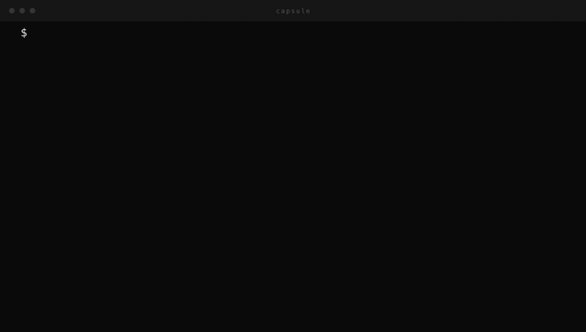

<div align="center">

# Capsule

**Compact, source-linked context packs for coding agents.**



<br/>

[](https://www.npmjs.com/package/capsulectx)
[](LICENSE)
[](package.json)
[](https://github.com/dawitlabs/capsule/actions)

</div>

---

MCP gives agents tools. Skills give agents procedures. Capsules give agents compact project context.

Large repositories make coding agents burn tokens rediscovering the same files, decisions, conventions, and setup details over and over. Capsule targets a **50–70% reduction in repeated repository-discovery context** for large, multi-session agent work.

## Quickstart

```bash
npx capsulectx init
```

Capsule scans your repo and creates:

```
.capsules/
  index.md
  architecture.md
  setup.md
  api.md
  data.md
  ui.md
  testing.md
  deployment.md
```

Each capsule is a Markdown file with source fingerprints in JSON frontmatter:

```md
---json
{
  "name": "api",
  "sources": ["src/api/**"],
  "fingerprints": { "src/api/users.ts": "sha256:..." },
  "updated_at": "2026-06-20T14:00:00.000Z"
}
---

# API Capsule

## Purpose

Request handlers, routes, controllers, and service boundaries.

## Key Files

- `src/api/users.ts`: source file matched by this capsule.

## Decisions

- Record stable decisions here so future agents do not rediscover them.
```

Agents read `.capsules/index.md`, choose the relevant capsule, check staleness, then inspect only the source files that actually matter.

## Commands

| Command | What it does |
|---|---|
| `capsule init` | Scan repo and create all `.capsules/*.md` files |
| `capsule scan` | Print detected source groups without writing |
| `capsule write <name>` | Refresh one capsule (preserves your edits) |
| `capsule get <name>` | Print one capsule to stdout |
| `capsule stale [name]` | Check which source files changed since last write |
| `capsule estimate <name>` | Show estimated token savings for one capsule |

## Seeing the savings

```
$ capsule estimate architecture

Capsule: architecture

Without Capsule:
  files: 5
  estimated tokens: 9,607

With Capsule:
  capsule plus stale files: 1
  stale source files: 0
  estimated tokens: 417

Estimated discovery savings: 96%
```

The estimator is directional — it uses 4 characters per token as a conservative approximation.

## Agent Workflow

Add this to `AGENTS.md`, `CLAUDE.md`, Cursor rules, or your agent instructions:

```md
Before working in this repo:

1. Read `.capsules/index.md` if it exists.
2. Read the capsule matching the task area.
3. Run `capsule stale <name>` when the CLI is available.
4. If stale, inspect changed source files before editing.
5. Update capsules when durable project knowledge changes.
```

Works with any agent that can read files — Claude Code, Codex, Cursor, Windsurf, Devin, custom MCP agents.

## Custom Groups

Capsule detects standard layouts out of the box. For non-standard structure, add `.capsules/config.json`:

```json
{
  "groups": [
    {
      "name": "workers",
      "description": "Background jobs, queues, and scheduled tasks.",
      "sources": ["src/workers/**", "src/jobs/**"]
    }
  ],
  "ignore": ["legacy/**"]
}
```

A `groups` entry with the same `name` as a default group overrides it. New names are appended. `ignore` patterns extend the default ignore list.

## Building the Demo

The animation in this README is a generated GIF — no screen-recording tools required.

```bash
npm run demo
```

Requires `rsvg-convert` (`librsvg` / `librsvg2-tools`) and `ffmpeg`. The script outputs `docs/demo.gif` from SVG frames rendered at 2× for retina. See [`scripts/build-demo.mjs`](scripts/build-demo.mjs).

## Status

Capsule is early — v0, local-only, no paid LLM calls.

**In v0.1:**
- local CLI, language-agnostic repo scanning
- Markdown context packs with source fingerprints
- stale detection, token savings estimation
- write-safe re-generation (human edits preserved)
- custom group config via `.capsules/config.json`

**Roadmap:**
- `capsule prompt claude|codex|cursor` — inject capsule into agent context directly
- smarter `write` that diffs source changes and suggests updates
- better source grouping for monorepos
- before/after token reports for real agent sessions
- GitHub Action for stale capsule checks in CI
- public capsule format spec

## Install for Local Development

```bash
git clone https://github.com/dawitlabs/capsule.git
cd capsule
npm install
npm run build
node dist/cli.js init
```

## License

MIT
